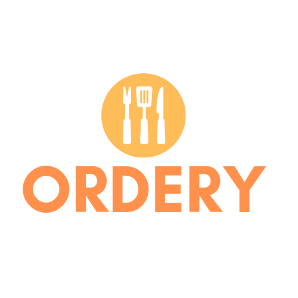

# ORDERY - Smart Restaurant Management System



**ORDERY** is a full-stack, web-based platform designed to bridge the gap between diners and restaurant owners. By digitizing the menu and ordering process, it minimizes physical contact and streamlines kitchen operations. 

---

## 📖 Overview

The system provides a dual-interface experience:
1.  **Customer Interface:** A mobile-responsive web app where users scan a QR code at their table to view a digital menu, place orders, and track their preparation status.
2.  **Management Dashboard:** A backend portal for restaurant staff to manage live orders, handle table reservations, and update menu availability.


---

## 🚀 Key Features

### 🍽️ For the Diner
* **QR-Powered Check-in:** Instant access to the menu via browser-based scanning (powered by Instascan).
* **Smart Cart:** Add items, customize orders, and see real-time price calculations.
* **Reservation System:** Schedule tables for future dates with an automated confirmation workflow.
* **Live Tracking:** Follow the order status from "Received" to "In Preparation" to "Served."
* **Feedback Loop:** Rate the dining experience and view personal order history.

### 👨‍🍳 For the Restaurant
* **Live Request Queue:** Manage incoming orders and reservations in real-time.
* **Order Control:** Accept or decline orders based on kitchen capacity or item availability.
* **Authentication:** Secure login portals for both users and restaurant administrators.
* **User Management:** Centralized control over customer data and previous interactions.

---

## 🛠️ Technical Stack

| Component | Technology |
| :--- | :--- |
| **Frontend** | HTML5, CSS3, SCSS, Less, JavaScript |
| **Backend** | PHP (Server-side logic) |
| **Database** | MySQL |
| **QR Scanning** | Instascan JS Library |
| **Styling** | Custom CSS & Responsive Layouts |

---

## 📂 Project Structure

```text
ORDERY/
├── Restaurant side/      # Staff dashboard for order/reservation management
├── landing/              # Marketing and introductory pages
├── instascan-master/     # Library for browser-side QR code processing
├── user-login/           # Customer login/registration modules
├── restaurant-login/     # Business login/registration modules
├── dbconnect.php         # Database configuration and connection logic
├── menu.php              # Dynamic menu display based on database records
├── order.php             # Core logic for processing customer orders
├── qrscan.php            # QR scanning interface for mobile users
├── Reservation.php       # Table booking logic
└── history.php           # User's personal dining history
